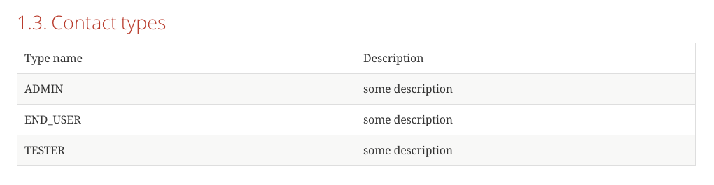

# Spring REST Docs. Code based documentation
## Disclaimer
This blog post is not going to cover the basics of using the Spring REST Docs. 
On the internet you can find several tutorials on how to get started with it. I.e. [this](https://spring.io/guides/gs/testing-restdocs/)
 or [this one](https://www.baeldung.com/spring-rest-docs). 
The goal of this blog post is to provide more insights into an  advanced feature, namely - generating custom documentation snippets, which are based on your code. 
For instance such snippet can contain a table with all possible enumeration values of a field in request payload for a RESTful API.
## Technical stack
For a sample project I chose following technologies:
- [Kotlin](https://kotlinlang.org/) programming language
- [Ktor](https://ktor.io) framework for implementing of the sample RESTful API
- [Koin](https://insert-koin.io/) framework for the dependency injection
- [JUnit 5](https://junit.org/junit5/) for running tests
- [REST Assured](http://rest-assured.io) in conjunction with Spring REST Docs for generating of documentation
- [Gradle](https://gradle.org/) (Kotlin) for building 
 
## Project overview
As a sample project I prepared a simple Contact API for creating of contacts.
The source code of the project can be found [here](https://github.com/rt-krz/spring-rest-docs-custom-snippets).
  
First I prepared a Ktor-`Application`:
```kotlin
fun main(args: Array<String>) {
    // Start Ktor
    embeddedServer(Netty, commandLineEnvironment(args)).start()
}

fun Application.main() {
    install(Koin) {
        modules(dependencies)
    }
    install(DefaultHeaders) {
    }
    install(CallLogging) {
        level = Level.DEBUG
    }

    install(ContentNegotiation) {
        jackson {
            // Configure Jackson's ObjectMapper here
        }
    }

    val createContactHandler: CreateContactHandler by inject()

    routing {
        post("/contacts/") {
            createContactHandler.handle(call)
        }
    }
}
```
You see here a defined `POST`-route `/contacts/` for creating of a new contact. Call to the route is passed to the  
`CreateContactHandler` (injected by `Koin`):
```kotlin
class CreateContactHandler {
    companion object : KLogging()

    suspend fun handle(call: ApplicationCall) {
        val request = call.receive(CreateContactRequest::class)
        logger.debug { "handling create contact request: $request" }
        //do handling
        val response = CreateContactResponse(UUID.randomUUID().toString())
        call.respond(response)
    }
}

data class CreateContactRequest(
    val contactKey: String,
    val type: ContactType
)

data class CreateContactResponse(
    val contactKey: String
)
```
The handler takes incoming request, deserialize JSON payload, handle it, respond with another JSON payload.

## Documentation generation
To generate documentation I use following unit test:
```kotlin
@ExtendWith(RestDocumentationExtension::class)
class ContactApiDocTest {
    private val embeddedServer = embeddedServer(factory = Netty, port = 8080, module = Application::main)
        .apply { start() }

    lateinit var spec: RequestSpecification


    @BeforeEach
    fun setup(restDocumentation: RestDocumentationContextProvider) {
        this.spec = RequestSpecBuilder()
            .addFilter(
                RestAssuredRestDocumentation.documentationConfiguration(restDocumentation)
                    .operationPreprocessors()
                    .withRequestDefaults(
                        Preprocessors.prettyPrint()
                    )
                    .withResponseDefaults(
                        Preprocessors.prettyPrint()
                    )
                    .and()
                    .snippets().withAdditionalDefaults(contactTypesSnippet())
            )
            .build()
    }

    @Test
    fun `should generate docs`() {
        given(this.spec)
            .header(HttpHeaders.CONTENT_TYPE, "application/json")
            .filter(document("create-contact"))
            .body(CreateContactRequest(contactKey = UUID.randomUUID().toString(), type = ContactType.END_USER))
            .`when`()
            .port(8080)
            .post("/contacts")
            .then()
            .assertThat()
            .statusCode(200)
            .header(HttpHeaders.CONTENT_TYPE, "application/json; charset=UTF-8")
    }
}
```
The code represents typical `Spring REST Docs` test, which starts embedded web server and send a request to it.
Thanks to `RestDocumentationExtension` and corresponding configuration in the `setup()` standard snippets are
generated into the `build/generated-snippets` folder:
```bash
✔ 18:37 ~/projects/contactapi/build/generated-snippets/create-contact $ ll
total 56
Aug 12 14:17 .
Aug  9 17:28 ..
Aug 12 14:21 contact-types.adoc
Aug 12 14:21 curl-request.adoc
Aug 12 14:21 http-request.adoc
Aug 12 14:21 http-response.adoc
Aug 12 14:21 httpie-request.adoc
Aug 12 14:21 request-body.adoc
Aug 12 14:21 response-body.adoc
```
Later on you need to put a file `index.adoc` into your `src/docs/asciidoc`. This is your starting point for writing 
docs. Put there following text to get started:
```asciidoc
= Contact API
Kreuzwerker Author;
:doctype: book
:icons: font
:source-highlighter: highlightjs
:toc: left
:sectnums:

== Intro
Once upon a time

=== Request
include::{snippets}/create-contact/curl-request.adoc[]

include::{snippets}/create-contact/http-request.adoc[]

=== Response
include::{snippets}/create-contact/response-body.adoc[]

include::{snippets}/create-contact/http-response.adoc[]
```
As you see I included some snippets which were generated in the previous steps.

Now you can start docs generation with the `gradle`:
```bash
~/projects/contactapi [master] $ ./gradlew asciidoctor
```
After successful generation open it from `build/asciidoc/html5/index.html`

Now you got an overview about standard features of `Spring REST Docs` and we're up to continue with

## Custom snippets docs based on your code
As you saw above our `CreateContactRequest` has a field of type `ContactType`. The `ContactType` is enum class:
```kotlin
enum class ContactType {
    ADMIN,
    END_USER,
    TESTER
}
```
and I would like to document the possible values of the field, which can be passed as request payload. 
Let's say in form of a table. For this sake you should create a custom snippet for `Spring REST Docs`.

First step is to add a classing extending `TemplatedSnippet`:
```kotlin
class ContactTypesSnippet(snippetName: String?, attributes: MutableMap<String, Any>?)
    : TemplatedSnippet(snippetName, attributes) {
    companion object {
        const val SNIPPET_NAME = "contact-types"
    }

    constructor() : this(SNIPPET_NAME, null)

    override fun createModel(operation: Operation?): Map<String, Any> {
        return mapOf(
            "contactTypes" to ContactType.values()
        )
    }
}

fun contactTypesSnippet() = ContactTypesSnippet()
``` 
You see that in the method `createModel` you add array of all values from the `ContactType` enum under name `contactTypes` 

Secondly you configure the additional custom snippet in the unit test with
`and().snippets().withAdditionalDefaults(contactTypesSnippet())`
```kotlin
@BeforeEach
fun setup(restDocumentation: RestDocumentationContextProvider) {
    this.spec = RequestSpecBuilder()
        .addFilter(
            RestAssuredRestDocumentation.documentationConfiguration(restDocumentation)
                .operationPreprocessors()
                .withRequestDefaults(
                    Preprocessors.prettyPrint(),
                    Preprocessors.removeHeaders("Host", "Content-Length")
                )
                .withResponseDefaults(
                    Preprocessors.prettyPrint(),
                    Preprocessors.removeHeaders("Date", "Content-Length")
                )
                .and()
                .snippets().withAdditionalDefaults(contactTypesSnippet())
        )
        .build()
}
```
Afterwards you need to add a `Mustache` template. Put under `src/test/resources/org/springframework/restdocs/templates/asciidoctor/`
following `contact-types.snippet` file:
```handlebars
=== Contact types
|===
| Type name | Description
{{#contactTypes}}
| {{name}}
| some description
{{/contactTypes}}
|=== 
```
You see in the snippet we just define a new section and iterate over the array of contactTypes enum values. 
The `Description` column is static, but it can be easily provided by the enum as well.

Last step you need to include this snippet into your `index.adoc` by adding:
```asciidocs
include::{snippets}/create-contact/contact-types.adoc[]
```

Now run again `$ ./gradle asciidoctor` and as a result you'll see the following section in the docs:



## Conclusion
As you've seen you can generate great documentation relying completely on your code base. 
That means later you don't need to keep docs and code synchronous and just publish the docs every time you build your project 
(i.e. via Jenkins)  
